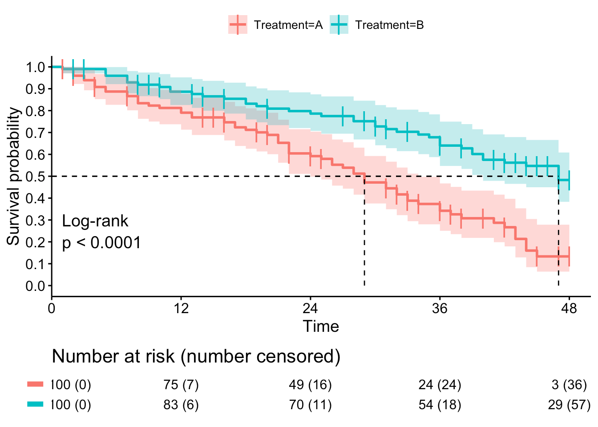

<h2 align="center">Reinforcement Learning Project
</h2> 

  

<h4 align="center">
    Itamar Nierenberg:
  
  
    
</a>

<h4 align="center">
    Stav Beno:
  
  
    
</a>

This project's goal is to optimize a policy for the Hazard Ratio metric using Bayesian methods

Table Of Contents
--
* [Background](#background)
* [File Tree](#file-tree)
* [Refrences](#refrences)

## Background
This project aims to optimize a policy that minimizes the hazard ratio 

## File Tree
| File Name                            | Purpose |
|--------------------------------------|---------|
| `CategoricalTD.py`                   |         |
| `HazardEnv.py`                       |         |
| `Params.py`                          |         |
| `PolicyOptimization.py`              |         |
| `runTest.py`                         |         |
| `Utils.py`                           |         |